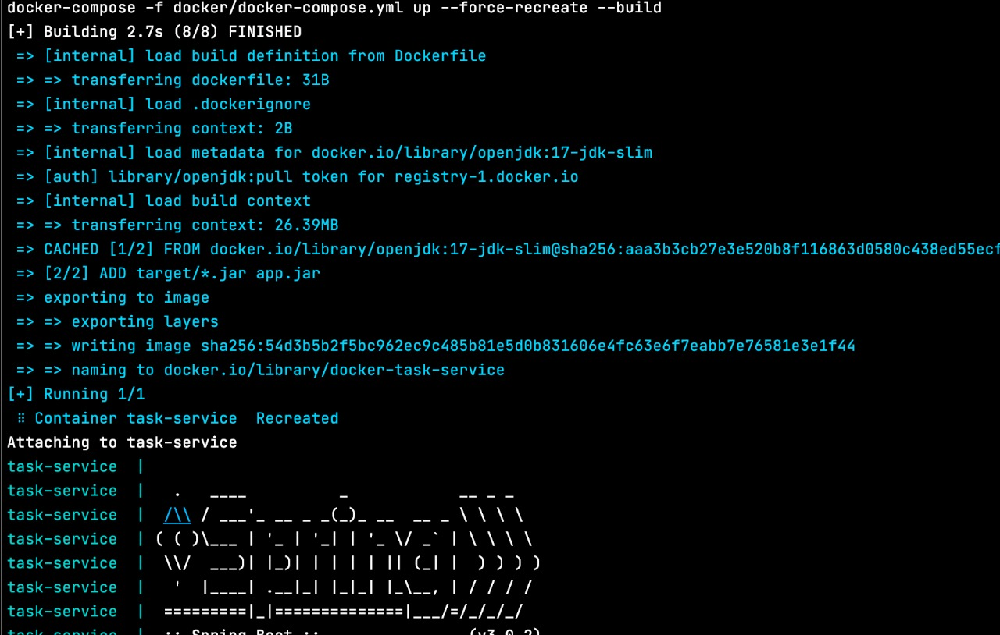
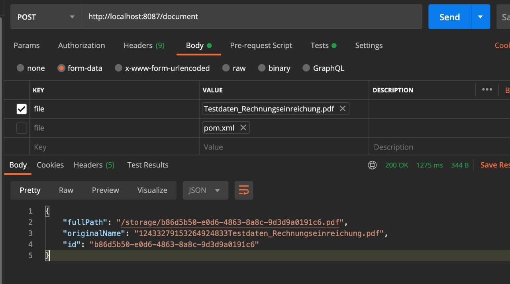
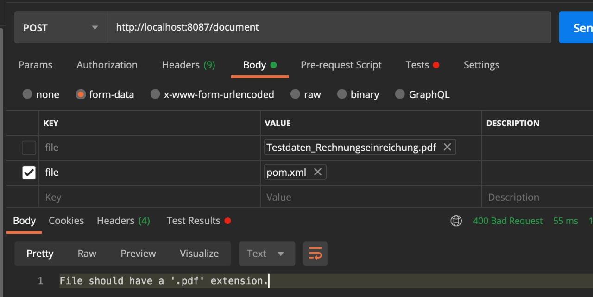
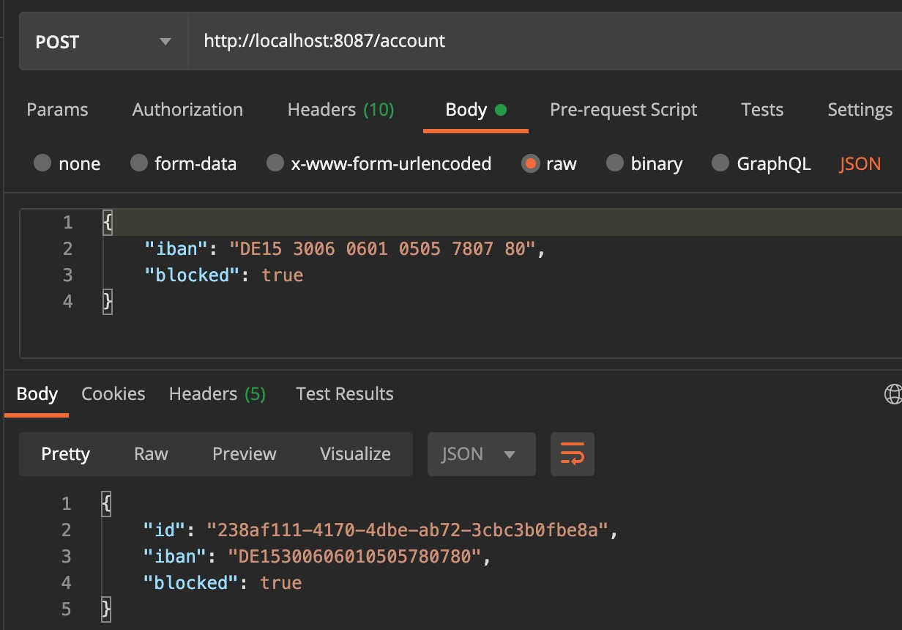
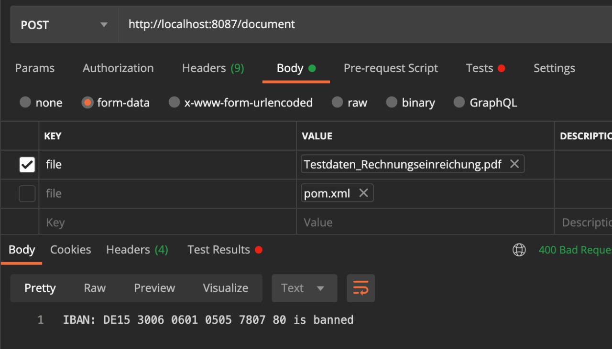

# Malware Scanning Application

Welcome to the Malware Scanning application. This tool is designed for scanning files and uploading them to a storage solution.

## Quick Start

To get the application up and running, execute the following command:

```
make run
```

To run tests, use the following command:

```
make test
```

For manual testing of the project, a Postman configuration is provided at:
```
/postman/MalwareScanner.postman_collection.json
```

## Business Logic Implementation

When uploading a file to the server, the following checks are performed:

1) The file is a PDF, verified by the magic byte. 
   Implemented in the service: 
   
   `domain.service.impl.PDFDocumentChecker`


2) The file does not contain an IBAN from the blacklist. 
   Implemented in the service: 
   
   `domain.service.impl.IBANDocumentChecker`

   Tested in: 
   
   `domain.service.IBANDocumentCheckerTest`


3) File uploads to the server and preliminary checks are done using DocumentChecker. 
   Implemented in the service: 
   
   `domain.service.impl.DocumentServiceImpl`
   
   Tested in: 
   
   `domain.service.InMemoryDocumentServiceTest`
   

4) Capability to upload files from a URL request is also implemented. As this utilizes Spring's functionality for pre-uploading files for saving, the implementation of the upload service is in the Application layer: 
   
   `application.service.DownloadServiceImpl`


5) For testing whether a file contains an IBAN from the blacklist, it is first necessary to add an Account with an IBAN set to blocked status using Postman or the console:
   ```
   curl --location --request POST 'http://localhost:8087/account'    --header 'Content-Type: application/json'    --data-raw '{
       "iban": "DE15 3006 0601 0505 7807 80",
       "blocked": true
   }'
   ```

## Integration Tests

Examples of integration tests that test application scenarios:

1) Uploading a PDF file expecting a successful upload: 
   
   `com.scanner.malwarescanning.integration.presentation.DocumentControllerTest#testSuccessDocumentSaving`


2) Uploading a file with a blocked IBAN: 
   
   `com.scanner.malwarescanning.integration.presentation.DocumentControllerTest#testFailOnBannedIBAN`


3) Uploading a PDF file that is not an actual PDF (i.e., does not contain the magic byte of a PDF): 
   
   `com.scanner.malwarescanning.integration.presentation.DocumentControllerTest#testFailOnFakePDFFile`

## Some thoughts about the design, security aspects and further work of the solution.

As an enhancement,

When using a cloud provider, such as AWS, files could be stored in S3 buckets.

Metadata about the files could be stored in Amazon DynamoDB or Elasticsearch.

For security, a security provider like Keycloak, coupled with Spring Security at the application level, could be utilized. Authentication and authorization through Keycloak would generate JWT tokens for communication between services, including the Malware Scanning service, while leveraging all features of Spring Security, such as stateless session management.

The project could also be fully covered with test cases.

Implement CI/CD for continuous application updates.

It might be logical to extract the Account handling logic into a separate microservice (domain), although it was not implemented within the scope of this project.

The project could be transformed into a microservices architecture if needed, adding an API Gateway, service discovery, external configuration, and other tools.

Consider asynchronous file uploads and the use of a message broker.

Implement load balancing and assess the service's scalability.

Add caching at various levels, for example, at the CDN level, as recommended by REST principles.

Transition to the HTTPS 2.0 protocol, or eventually to HTTP 3.0.

And other improvements.


## Test Results


## Application Execution Results



## Request Execution Outcomes via Postman





